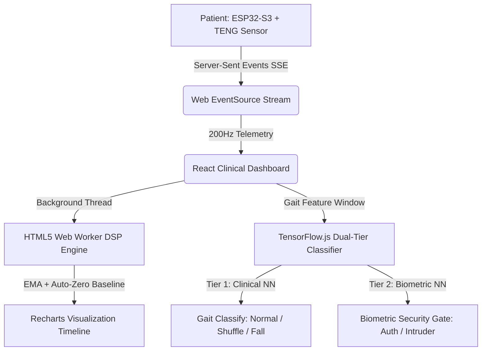

# StepGuard: Clinical-Grade Gait Analysis & Edge-Telemetry Platform

<p align="center">
  
  
  
  
</p>

StepGuard is an advanced wearable gait monitoring and diagnostic platform designed to detect **Freezing of Gait (FoG)**, tremors, and fall risks in patients with Parkinson's Disease and other neurodegenerative conditions. 

The system leverages self-powered **Triboelectric Nanogenerators (TENG)** combined with inertial sensors, streaming high-frequency physiological telemetry from an ESP32-S3 microcontroller to a React clinical dashboard. Real-time diagnostic inference is executed entirely client-side using a dual-tier TensorFlow.js neural network architecture.

---

## 🏗️ System Architecture



---

## 📂 Project Structure

- **`/arduino`** - C++ firmware containing FreeRTOS dual-core tasks, edge-level Kalman filtering, and the Server-Sent Events (SSE) server.
- **`/dashboard`** - React 19 + Vite web application containing the high-frequency DSP Web Worker, Recharts timeline, and clientside TensorFlow.js models.
- **`/ai_engine`** - PyTorch and TensorFlow training scripts, preprocessing scaling routines, and the TensorFlow.js web-model conversion pipeline.
- **`/clinical_datasets`** - Physiological data streams containing the global clinical baseline database and manual patient calibration files.

---

## 🚀 Key Features & Components

### 1. Hardware & Edge Processing ([StepGuard.ino](file:///home/sudo_ahilesh/Documents/StepGuard/arduino/StepGuard/StepGuard.ino))
- **Low-Jitter Sampling:** A hardware timer ISR triggers telemetry acquisition at precisely **200Hz**, notifying processing tasks via FreeRTOS direct-to-task notifications.
- **Edge Filtering:** Implements a single-state recursive **Kalman Filter** directly on the ESP32 to smooth signal noise.
- **Core Separation:** Pins sensor telemetry generation and Kalman filtering strictly to **Core 1** and handles network operations and SSE client streaming on **Core 0** to eliminate jitter.
- **SSE Telemetry Server:** Streams telemetry data over standard HTTP Server-Sent Events, minimizing protocol overhead.

### 2. High-Performance Dashboard DSP ([dspWorker.js](file:///home/sudo_ahilesh/Documents/StepGuard/dashboard/public/dspWorker.js))
- **Web Worker Offloading:** Offloads all filtering and calculations to a background HTML5 Web Worker to ensure the main React UI thread remains at 60fps.
- **Dynamic Baseline Tracking:** Employs an auto-zeroing baseline tracker to dynamically normalize charge offsets.
- **Schmitt Trigger Step Counter:** Integrates a hysteresis-based Schmitt trigger for step counting.

### 3. Dual-Tier Clientside AI ([App.jsx](file:///home/sudo_ahilesh/Documents/StepGuard/dashboard/src/App.jsx))
- **Tier 1 (Clinical Diagnostics):** A **1D-CNN + BiLSTM** model trained on a 300-point sliding window. It classifies walking patterns into *Normal Gait*, *Shuffling/FoG*, or *Fall Detected*, triggering emergency notifications and auditory signals when necessary.
- **Tier 2 (Biometric Security):** A lightweight **Conv1D + Global Average Pooling** model that extracts foot rollout dynamics to authenticate the user and detect intruders.

---

## 🛠️ Getting Started

### Prerequisites
Ensure you have **Node.js 20+** and **npm** installed.

### Running the Dashboard
1. Navigate to the dashboard directory:
   ```bash
   cd dashboard
   ```
2. Install dependencies:
   ```bash
   npm install
   ```
3. Launch the development server:
   ```bash
   npm run dev -- --host --port 5173
   ```
4. Open [http://localhost:5173](http://localhost:5173) in your browser.

### Flashing the Firmware
1. Open [StepGuard.ino](file:///home/sudo_ahilesh/Documents/StepGuard/arduino/StepGuard/StepGuard.ino) in the Arduino IDE or VS Code (with ESP32 board support installed).
2. Configure your Wi-Fi credentials in `secrets.h`.
3. Flash the code to your Seeed Studio XIAO ESP32-S3.
4. Enter the ESP32 IP address displayed in the serial monitor into the dashboard connection input.
